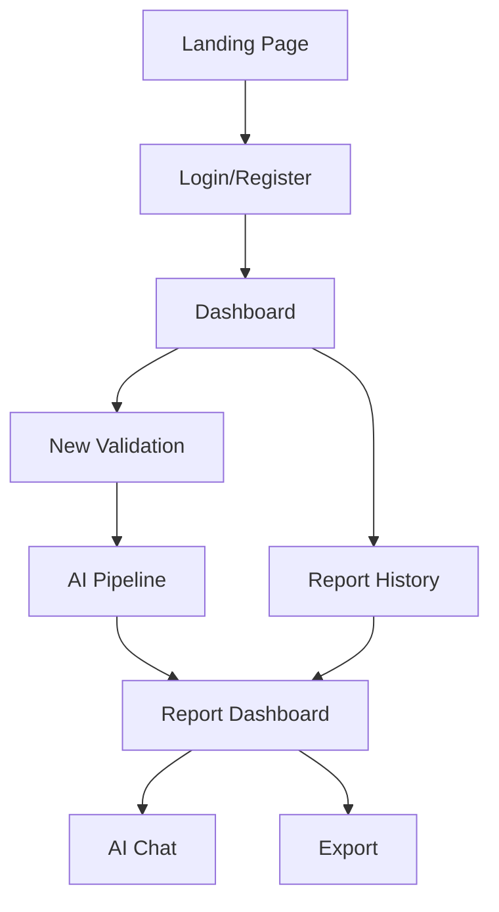

# Startup Validator AI — Stage-Wise Implementation Plan

> A complete, LLM-executable blueprint for building an AI-powered startup intelligence platform.
> Each stage has clear inputs, outputs, file paths, code patterns, and acceptance criteria.

---

## Architecture Overview

```
Tech Stack:
├── Frontend:  Next.js 14 (App Router) + TypeScript
├── Styling:   Tailwind CSS v3 + Framer Motion
├── Charts:    Recharts
├── State:     Zustand (lightweight global state)
├── Auth:      NextAuth.js (credentials provider — email/password, no OAuth needed)
├── Database:  SQLite via Prisma (zero-config, file-based, hackathon-friendly)
├── AI:        Google Gemini API (gemini-2.0-flash for speed)
├── Export:    react-markdown + html2canvas/print CSS for PDF
└── Deploy:    Vercel (or local demo)
```



---

## Project Directory Structure

```
bahin ka startup/
├── prisma/
│   └── schema.prisma
├── public/
│   └── fonts/
├── src/
│   ├── app/
│   │   ├── layout.tsx                 # Root layout, fonts, providers
│   │   ├── page.tsx                   # Landing page
│   │   ├── globals.css                # Global styles + design tokens
│   │   ├── (auth)/
│   │   │   ├── login/page.tsx
│   │   │   └── register/page.tsx
│   │   ├── (dashboard)/
│   │   │   ├── layout.tsx             # Dashboard shell (sidebar + topbar)
│   │   │   ├── dashboard/page.tsx     # Main dashboard
│   │   │   ├── new/page.tsx           # New validation form
│   │   │   ├── history/page.tsx       # Report history
│   │   │   └── report/[id]/page.tsx   # Report dashboard
│   │   └── api/
│   │       ├── auth/[...nextauth]/route.ts
│   │       ├── validate/route.ts      # AI pipeline trigger
│   │       ├── chat/route.ts          # AI chat endpoint
│   │       ├── reports/route.ts       # CRUD reports
│   │       └── reports/[id]/route.ts  # Single report
│   ├── components/
│   │   ├── ui/                        # Reusable primitives
│   │   │   ├── Button.tsx
│   │   │   ├── Card.tsx
│   │   │   ├── Input.tsx
│   │   │   ├── Badge.tsx
│   │   │   ├── Tabs.tsx
│   │   │   ├── Modal.tsx
│   │   │   ├── Skeleton.tsx
│   │   │   ├── Toast.tsx
│   │   │   └── Spinner.tsx
│   │   ├── landing/                   # Landing page sections
│   │   │   ├── Hero.tsx
│   │   │   ├── Features.tsx
│   │   │   ├── HowItWorks.tsx
│   │   │   └── CTA.tsx
│   │   ├── dashboard/                 # Dashboard components
│   │   │   ├── Sidebar.tsx
│   │   │   ├── Topbar.tsx
│   │   │   ├── ReportCard.tsx
│   │   │   └── EmptyState.tsx
│   │   ├── report/                    # Report dashboard components
│   │   │   ├── ScoreCards.tsx
│   │   │   ├── ReportTabs.tsx
│   │   │   ├── ExecutiveSummary.tsx
│   │   │   ├── MarketAnalysis.tsx
│   │   │   ├── SimilarBusinesses.tsx
│   │   │   ├── CompetitorAnalysis.tsx
│   │   │   ├── SwotAnalysis.tsx
│   │   │   ├── BusinessModel.tsx
│   │   │   ├── FinancialAnalysis.tsx
│   │   │   ├── Roadmap.tsx
│   │   │   ├── InvestorPitch.tsx
│   │   │   ├── Charts.tsx
│   │   │   └── AiChat.tsx
│   │   └── export/
│   │       └── ExportMenu.tsx
│   ├── lib/
│   │   ├── ai/
│   │   │   ├── pipeline.ts            # Orchestrates multi-step AI generation
│   │   │   ├── prompts.ts             # All prompt templates
│   │   │   ├── scoring.ts             # Deterministic score computation
│   │   │   └── gemini.ts              # Gemini API client wrapper
│   │   ├── db.ts                      # Prisma client singleton
│   │   ├── auth.ts                    # NextAuth config
│   │   ├── schema.ts                  # Report JSON schema (Zod)
│   │   ├── demo-data.ts              # Pre-generated demo report
│   │   └── utils.ts                   # Helpers
│   ├── store/
│   │   └── useReportStore.ts          # Zustand store for active report
│   └── types/
│       └── report.ts                  # TypeScript types (generated from Zod)
├── .env.local
├── next.config.js
├── tailwind.config.ts
├── tsconfig.json
├── package.json
└── IMPLEMENTATION_PLAN.md             # This file (read-only reference)
```

---

## Report JSON Schema (Define FIRST)

> [!IMPORTANT]
> This schema is the single source of truth. Every component — AI prompts, frontend cards, export templates, database storage — references this schema. Define it before writing any other code.

```typescript
// src/lib/schema.ts — Use Zod for runtime validation

import { z } from 'zod';

// --- Sub-schemas ---

const ScoreWithReasoningSchema = z.object({
  score: z.number().min(0).max(100),
  label: z.enum(['Excellent', 'Strong', 'Promising', 'Moderate', 'Needs Work', 'High Risk']),
  reasoning: z.string(), // 1-2 sentence explanation
  confidence: z.enum(['high', 'medium', 'low']),
});

const SimilarBusinessSchema = z.object({
  company: z.string(),
  industry: z.string(),
  stage: z.string(), // e.g., "Series B", "Acquired", "Failed"
  businessModel: z.string(),
  outcome: z.string(),
  keyLessons: z.string(),
  isVerified: z.boolean(), // true = publicly known, false = AI estimate
  source: z.string().optional(), // URL or "AI Estimate"
});

const CompetitorSchema = z.object({
  name: z.string(),
  description: z.string(),
  strengths: z.array(z.string()),
  weaknesses: z.array(z.string()),
  marketShare: z.string().optional(), // "~15% (AI estimate)"
  differentiator: z.string(),
});

const SwotSchema = z.object({
  strengths: z.array(z.object({ point: z.string(), detail: z.string() })),
  weaknesses: z.array(z.object({ point: z.string(), detail: z.string() })),
  opportunities: z.array(z.object({ point: z.string(), detail: z.string() })),
  threats: z.array(z.object({ point: z.string(), detail: z.string() })),
});

const FinancialProjectionSchema = z.object({
  year: z.number(),
  revenue: z.number(),
  costs: z.number(),
  profit: z.number(),
  users: z.number(),
  isEstimate: z.boolean().default(true),
});

const RoadmapPhaseSchema = z.object({
  phase: z.string(), // "Phase 1: MVP"
  timeline: z.string(), // "Month 1-3"
  goals: z.array(z.string()),
  keyMilestones: z.array(z.string()),
  estimatedCost: z.string().optional(),
});

const RiskSchema = z.object({
  category: z.string(), // "Market", "Technical", "Financial", "Legal", "Team"
  risk: z.string(),
  severity: z.enum(['Critical', 'High', 'Medium', 'Low']),
  mitigation: z.string(),
});

// --- Main Report Schema ---

export const ReportSchema = z.object({
  id: z.string().uuid(),
  createdAt: z.string().datetime(),
  updatedAt: z.string().datetime(),

  // Input
  startup: z.object({
    name: z.string(),
    idea: z.string(),
    industry: z.string(),
    targetMarket: z.string(),
    stage: z.string().optional(), // "Idea", "MVP", "Growth"
    teamSize: z.string().optional(),
    funding: z.string().optional(),
  }),

  // Scores (computed deterministically from section scores)
  scores: z.object({
    overall: ScoreWithReasoningSchema,
    innovation: ScoreWithReasoningSchema,
    marketPotential: ScoreWithReasoningSchema,
    scalability: ScoreWithReasoningSchema,
    risk: ScoreWithReasoningSchema, // Inverted: higher = riskier
    investmentReadiness: ScoreWithReasoningSchema,
  }),

  // Sections
  executiveSummary: z.object({
    hook: z.string(), // One compelling sentence
    overview: z.string(),
    keyInsights: z.array(z.string()),
    recommendation: z.string(),
  }),

  marketAnalysis: z.object({
    marketSize: z.object({
      tam: z.string(), // Total Addressable Market
      sam: z.string(), // Serviceable Addressable Market
      som: z.string(), // Serviceable Obtainable Market
      isEstimate: z.boolean().default(true),
    }),
    trends: z.array(z.string()),
    targetAudience: z.string(),
    marketGaps: z.array(z.string()),
  }),

  similarBusinesses: z.array(SimilarBusinessSchema),

  competitors: z.array(CompetitorSchema),

  swot: SwotSchema,

  businessModel: z.object({
    type: z.string(), // "SaaS", "Marketplace", "Freemium"
    revenueStreams: z.array(z.object({ stream: z.string(), description: z.string() })),
    pricingStrategy: z.string(),
    unitEconomics: z.object({
      cac: z.string(), // Customer Acquisition Cost
      ltv: z.string(), // Lifetime Value
      paybackPeriod: z.string(),
      isEstimate: z.boolean().default(true),
    }),
  }),

  financials: z.object({
    projections: z.array(FinancialProjectionSchema),
    fundingNeeded: z.string(),
    breakEvenTimeline: z.string(),
    keyAssumptions: z.array(z.string()),
  }),

  roadmap: z.array(RoadmapPhaseSchema),

  risks: z.array(RiskSchema),

  investorPitch: z.object({
    elevatorPitch: z.string(), // 30-second version
    problemStatement: z.string(),
    solution: z.string(),
    whyNow: z.string(),
    askAmount: z.string(),
    useOfFunds: z.array(z.object({ category: z.string(), percentage: z.number() })),
  }),

  goToMarket: z.object({
    strategy: z.string(),
    channels: z.array(z.object({ channel: z.string(), priority: z.string(), rationale: z.string() })),
    launchPlan: z.string(),
    metricsToTrack: z.array(z.string()),
  }),

  // Metadata
  generationMeta: z.object({
    model: z.string(),
    totalTokens: z.number().optional(),
    generationTimeMs: z.number().optional(),
    sectionsGenerated: z.array(z.string()),
    errors: z.array(z.string()).optional(),
  }),
});

export type Report = z.infer<typeof ReportSchema>;
export type ScoreWithReasoning = z.infer<typeof ScoreWithReasoningSchema>;
```

---

## Scoring System (Deterministic)

> [!IMPORTANT]
> Scores are NOT invented by the AI as a single number. Each AI section returns sub-scores. The backend computes finals using fixed weights. This makes scores explainable.

```typescript
// src/lib/ai/scoring.ts

const SCORE_WEIGHTS = {
  overall: {
    innovation: 0.20,
    marketPotential: 0.25,
    scalability: 0.15,
    financialViability: 0.15,
    teamReadiness: 0.10,
    competitiveAdvantage: 0.15,
  },
  investmentReadiness: {
    marketPotential: 0.25,
    financialViability: 0.25,
    teamReadiness: 0.20,
    scalability: 0.15,
    competitiveAdvantage: 0.15,
  },
};

function getLabel(score: number): string {
  if (score >= 85) return 'Excellent';
  if (score >= 70) return 'Strong';
  if (score >= 55) return 'Promising';
  if (score >= 40) return 'Moderate';
  if (score >= 25) return 'Needs Work';
  return 'High Risk';
}

export function computeOverallScore(sectionScores: Record<string, number>): ScoreWithReasoning {
  let weightedSum = 0;
  for (const [key, weight] of Object.entries(SCORE_WEIGHTS.overall)) {
    weightedSum += (sectionScores[key] || 50) * weight;
  }
  const score = Math.round(weightedSum);
  return {
    score,
    label: getLabel(score),
    reasoning: `Computed from ${Object.keys(SCORE_WEIGHTS.overall).length} weighted dimensions.`,
    confidence: score > 70 ? 'high' : score > 40 ? 'medium' : 'low',
  };
}
```

---

## AI Generation Pipeline

> [!IMPORTANT]
> DO NOT generate everything in one prompt. Use a multi-step pipeline with parallel branches. Stream sections to the UI as they complete.

```
Step 1 (Sequential): Understand Startup
  Input:  User's startup idea + details
  Output: Structured startup profile + industry classification
  Prompt: "Parse and structure this startup idea..."

Step 2 (Sequential): Market Analysis
  Input:  Structured startup profile
  Output: Market size, trends, target audience, gaps
  Prompt: "Analyze the market for this startup..."

Step 3 (Parallel — run ALL simultaneously):
  ├── Financial Analysis   → projections, unit economics
  ├── SWOT Analysis        → strengths, weaknesses, opportunities, threats
  ├── Similar Businesses   → 5-8 similar companies with outcomes
  ├── Competitor Analysis  → 4-6 direct/indirect competitors
  ├── Roadmap Generation   → 4 phases with milestones
  ├── Business Model       → revenue streams, pricing
  ├── Go-To-Market         → channels, launch plan
  └── Investor Pitch       → elevator pitch, problem/solution, ask

Step 4 (Sequential): Compute Scores
  Input:  All section outputs + their sub-scores
  Output: Final weighted scores with labels
  Method: Deterministic computation (NOT AI)

Step 5 (Sequential): Executive Summary
  Input:  All sections + scores
  Output: Hook, overview, key insights, recommendation
  Prompt: "Synthesize a concise executive summary..."

Step 6: Assemble & Validate
  - Merge all sections into ReportSchema
  - Validate with Zod
  - Handle any missing/malformed sections with fallbacks
  - Save to database
```

### Prompt Engineering Rules

```
FOR EVERY AI PROMPT:
1. Always request JSON output: "Respond ONLY with valid JSON matching this schema: {...}"
2. Include the schema structure in the prompt
3. Specify: "If you cannot verify a fact, set isEstimate: true and prefix with 'AI Estimate:'"
4. Keep temperature at 0.7 for creativity, 0.3 for analysis
5. Set max tokens appropriately per section (500-1500)
6. Include the startup context from Step 1 in every prompt
7. Handle parse failures: try JSON.parse, then regex extract JSON, then retry once
```

### Streaming Strategy

```typescript
// API route uses Server-Sent Events (SSE) to stream sections
// src/app/api/validate/route.ts

export async function POST(req: Request) {
  const encoder = new TextEncoder();
  const stream = new ReadableStream({
    async start(controller) {
      const send = (event: string, data: any) => {
        controller.enqueue(encoder.encode(`event: ${event}\ndata: ${JSON.stringify(data)}\n\n`));
      };

      // Step 1: Parse startup
      send('status', { step: 'understanding', message: 'Understanding your startup...' });
      const profile = await parseStartup(input);
      send('section', { key: 'startup', data: profile });

      // Step 2: Market analysis
      send('status', { step: 'market', message: 'Analyzing market...' });
      const market = await analyzeMarket(profile);
      send('section', { key: 'marketAnalysis', data: market });

      // Step 3: Parallel generation
      send('status', { step: 'parallel', message: 'Deep analysis in progress...' });
      const results = await Promise.allSettled([
        generateFinancials(profile, market),
        generateSwot(profile, market),
        generateSimilarBusinesses(profile),
        generateCompetitors(profile, market),
        generateRoadmap(profile),
        generateBusinessModel(profile, market),
        generateGoToMarket(profile, market),
        generateInvestorPitch(profile, market),
      ]);

      // Stream each as it resolves
      const sectionKeys = ['financials', 'swot', 'similarBusinesses', 'competitors',
                           'roadmap', 'businessModel', 'goToMarket', 'investorPitch'];
      results.forEach((result, i) => {
        if (result.status === 'fulfilled') {
          send('section', { key: sectionKeys[i], data: result.value });
        } else {
          send('error', { key: sectionKeys[i], message: result.reason.message });
        }
      });

      // Step 4: Compute scores
      const scores = computeScores(results);
      send('section', { key: 'scores', data: scores });

      // Step 5: Executive summary
      const summary = await generateExecutiveSummary(profile, market, scores);
      send('section', { key: 'executiveSummary', data: summary });

      send('complete', { reportId: savedReport.id });
      controller.close();
    },
  });

  return new Response(stream, {
    headers: { 'Content-Type': 'text/event-stream', 'Cache-Control': 'no-cache' },
  });
}
```

---

# STAGES

---

## Stage 0: Project Setup & Schema (Time: 30 min)

### What to Do

1. **Initialize Next.js project** in `/home/yash/Projects/bahin ka startup/`
2. **Install all dependencies** in one shot
3. **Configure Tailwind, TypeScript, Prisma**
4. **Define the Report schema** (Zod + Prisma)
5. **Create demo data** file with one pre-generated report
6. **Set up environment variables**

### Commands

```bash
# Initialize
cd "/home/yash/Projects/bahin ka startup"
npx -y create-next-app@latest ./ --typescript --tailwind --eslint --app --src-dir --import-alias "@/*" --use-npm

# Install dependencies
npm install @prisma/client zod zustand framer-motion recharts react-markdown
npm install next-auth@latest @auth/prisma-adapter bcryptjs
npm install -D prisma @types/bcryptjs

# Initialize Prisma with SQLite
npx prisma init --datasource-provider sqlite
```

### Files to Create

| File | Purpose |
|------|---------|
| `prisma/schema.prisma` | User + Report models |
| `src/lib/schema.ts` | Zod report schema (copy from above) |
| `src/lib/demo-data.ts` | One complete pre-generated report |
| `src/lib/db.ts` | Prisma client singleton |
| `.env.local` | `GEMINI_API_KEY`, `NEXTAUTH_SECRET`, `DATABASE_URL` |

### Prisma Schema

```prisma
generator client {
  provider = "prisma-client-js"
}

datasource db {
  provider = "sqlite"
  url      = env("DATABASE_URL")
}

model User {
  id            String    @id @default(cuid())
  name          String?
  email         String    @unique
  passwordHash  String
  reports       Report[]
  createdAt     DateTime  @default(now())
}

model Report {
  id        String   @id @default(uuid())
  userId    String
  user      User     @relation(fields: [userId], references: [id])
  title     String
  idea      String
  data      String   // JSON stringified report
  createdAt DateTime @default(now())
  updatedAt DateTime @updatedAt
}
```

### Acceptance Criteria

- [ ] `npm run dev` starts without errors
- [ ] Prisma schema compiles (`npx prisma generate`)
- [ ] Demo data file exports a valid `Report` object
- [ ] `ReportSchema.parse(demoData)` passes without errors

---

## Stage 1: Design System & UI Primitives (Time: 45 min)

### What to Do

Build reusable UI components BEFORE any pages. This prevents ad-hoc styling.

### Design Tokens (globals.css)

```css
/* Color Philosophy: Dark mode first, inspired by Linear/Vercel */
:root {
  --bg-primary: #0a0a0b;
  --bg-secondary: #111113;
  --bg-tertiary: #1a1a1f;
  --bg-card: #16161a;
  --bg-card-hover: #1e1e24;

  --border-primary: #2a2a30;
  --border-hover: #3a3a44;

  --text-primary: #ededef;
  --text-secondary: #8b8b94;
  --text-tertiary: #5c5c66;

  --accent-primary: #6366f1;     /* Indigo */
  --accent-secondary: #818cf8;
  --accent-glow: rgba(99, 102, 241, 0.15);

  --success: #22c55e;
  --warning: #f59e0b;
  --danger: #ef4444;
  --info: #3b82f6;

  --radius-sm: 6px;
  --radius-md: 10px;
  --radius-lg: 16px;
  --radius-xl: 24px;

  --font-sans: 'Inter', -apple-system, BlinkMacSystemFont, sans-serif;
  --font-mono: 'JetBrains Mono', 'Fira Code', monospace;

  --shadow-sm: 0 1px 2px rgba(0,0,0,0.3);
  --shadow-md: 0 4px 12px rgba(0,0,0,0.4);
  --shadow-lg: 0 8px 32px rgba(0,0,0,0.5);
  --shadow-glow: 0 0 20px var(--accent-glow);

  --transition-fast: 150ms ease;
  --transition-normal: 250ms ease;
  --transition-slow: 400ms cubic-bezier(0.16, 1, 0.3, 1);
}
```

### Components to Build

| Component | Props | Notes |
|-----------|-------|-------|
| `Button` | `variant: 'primary' \| 'secondary' \| 'ghost' \| 'danger'`, `size`, `loading`, `icon` | Subtle hover glow for primary |
| `Card` | `padding`, `hover`, `glow`, `className` | Glassmorphism border effect |
| `Input` | `label`, `error`, `icon`, `type` | Floating label animation |
| `Badge` | `variant: 'success' \| 'warning' \| 'danger' \| 'info' \| 'neutral'` | Score labels |
| `Tabs` | `tabs: {label, key}[]`, `activeTab`, `onChange` | Animated underline indicator |
| `Skeleton` | `width`, `height`, `lines` | Pulse animation |
| `Toast` | `type`, `message`, `duration` | Slide-in from top-right |
| `Spinner` | `size` | Indigo gradient spinner |
| `Modal` | `open`, `onClose`, `title` | Backdrop blur |
| `EmptyState` | `icon`, `title`, `description`, `action` | For empty history |

### Typography Rules

```
Headings:   Inter, font-weight 600-700, tracking-tight
Body:       Inter, font-weight 400, text-secondary
Captions:   Inter, font-weight 500, text-tertiary, text-xs uppercase tracking-wider
Mono:       JetBrains Mono for scores, numbers, code
```

### Acceptance Criteria

- [ ] All 10 UI components render correctly in isolation
- [ ] Dark theme applied globally
- [ ] Inter font loaded from Google Fonts
- [ ] Hover/focus states on all interactive elements
- [ ] Skeleton component shows pulse animation

---

## Stage 2: Authentication (Time: 30 min)

### What to Do

Simple email/password auth. No OAuth complexity.

### Files to Create/Modify

| File | Purpose |
|------|---------|
| `src/lib/auth.ts` | NextAuth configuration |
| `src/app/api/auth/[...nextauth]/route.ts` | Auth API route |
| `src/app/api/auth/register/route.ts` | Registration endpoint |
| `src/app/(auth)/login/page.tsx` | Login page |
| `src/app/(auth)/register/page.tsx` | Register page |
| `src/middleware.ts` | Protect dashboard routes |

### Auth Configuration

```typescript
// src/lib/auth.ts
import CredentialsProvider from 'next-auth/providers/credentials';
import bcrypt from 'bcryptjs';
import { prisma } from './db';

export const authOptions = {
  providers: [
    CredentialsProvider({
      name: 'credentials',
      credentials: {
        email: { label: 'Email', type: 'email' },
        password: { label: 'Password', type: 'password' },
      },
      async authorize(credentials) {
        const user = await prisma.user.findUnique({ where: { email: credentials.email } });
        if (!user) return null;
        const valid = await bcrypt.compare(credentials.password, user.passwordHash);
        return valid ? { id: user.id, email: user.email, name: user.name } : null;
      },
    }),
  ],
  session: { strategy: 'jwt' },
  pages: { signIn: '/login' },
};
```

### Login Page Design

- Centered card on dark gradient background
- Subtle animated gradient orbs in background (CSS only, no heavy JS)
- Email + password fields with floating labels
- "Create account" link below
- Error state with red border + message

### Acceptance Criteria

- [ ] User can register with email/password
- [ ] User can log in
- [ ] Invalid credentials show error
- [ ] Dashboard routes redirect to login if unauthenticated
- [ ] Session persists across page reloads

---

## Stage 3: Landing Page (Time: 45 min)

### What to Do

A single-page marketing site that sells the product. Inspired by Linear + Vercel aesthetics.

### Sections

#### Hero Section
- Large heading: "Validate Your Startup Idea in Minutes"
- Subheading: "AI-powered analysis. Market insights. Investor-ready reports."
- CTA Button: "Start Validating →" (links to /register or /dashboard)
- Subtle gradient mesh background
- Floating mock dashboard screenshot or animated score counter

#### Features Grid (3-4 cards)
- "AI-Powered Analysis" — icon + description
- "Market Intelligence" — icon + description
- "Investor-Ready Reports" — icon + description
- "Interactive AI Chat" — icon + description
- Each card has glassmorphism effect, subtle hover lift

#### How It Works (3 steps)
- "1. Describe Your Idea" → "2. AI Analyzes" → "3. Get Your Report"
- Connected with a subtle line/arrow
- Each step has an icon or small illustration

#### CTA Section
- "Ready to validate your next big idea?"
- Button: "Get Started Free →"

### Animation Rules

```
- Hero heading: fade-in + slight upward translate on mount (framer-motion)
- Feature cards: staggered fade-in on scroll (IntersectionObserver or framer-motion whileInView)
- CTA: subtle pulse on the button
- NO: particle effects, 3D, heavy WebGL, parallax scrolling
```

### Acceptance Criteria

- [ ] Page loads in under 2 seconds
- [ ] All sections visible and properly spaced
- [ ] CTA buttons link to appropriate routes
- [ ] Responsive on mobile (stacked layout)
- [ ] Animations are smooth (60fps)

---

## Stage 4: Dashboard Shell & History (Time: 45 min)

### What to Do

Build the authenticated dashboard layout (sidebar + topbar) and the report history page.

### Dashboard Layout

```
┌──────────────────────────────────────────────┐
│  ┌──────┐  Dashboard          user@email ▼   │
│  │ SIDE │                                    │
│  │ BAR  │  ┌────────────────────────────┐   │
│  │      │  │                            │   │
│  │ 📊   │  │     PAGE CONTENT           │   │
│  │ ✨   │  │                            │   │
│  │ 📜   │  │                            │   │
│  │      │  │                            │   │
│  │      │  └────────────────────────────┘   │
│  └──────┘                                    │
└──────────────────────────────────────────────┘
```

### Sidebar Items

| Icon | Label | Route |
|------|-------|-------|
| 📊 | Dashboard | `/dashboard` |
| ✨ | New Validation | `/new` |
| 📜 | History | `/history` |

### Dashboard Page (`/dashboard`)

- Welcome message: "Welcome back, {name}"
- Quick stats cards: Total Reports, Last Report Score, Average Score
- Recent reports list (last 3)
- "New Validation" CTA if no reports exist (EmptyState component)

### History Page (`/history`)

- List/grid of report cards
- Each card shows: Startup name, score badge, date, industry
- Click to open report
- Delete button (with confirmation modal)
- Empty state if no reports

### API Routes

```typescript
// GET /api/reports — List all reports for current user
// GET /api/reports/[id] — Get single report
// DELETE /api/reports/[id] — Delete report
```

### Acceptance Criteria

- [ ] Sidebar navigates between pages
- [ ] Dashboard shows user's reports or empty state
- [ ] History page lists all reports
- [ ] Reports can be deleted
- [ ] Skeleton loading states work
- [ ] Mobile: sidebar collapses to hamburger menu

---

## Stage 5: New Validation Form (Time: 30 min)

### What to Do

A clean, focused form where users describe their startup idea.

### Form Fields

| Field | Type | Required | Placeholder |
|-------|------|----------|-------------|
| Startup Name | text | yes | "e.g., EcoTrack" |
| Your Idea | textarea (large) | yes | "Describe your startup idea in detail..." |
| Industry | select | yes | Dropdown: SaaS, Fintech, HealthTech, EdTech, E-commerce, AI/ML, CleanTech, FoodTech, PropTech, Other |
| Target Market | text | yes | "e.g., Small business owners in India" |
| Current Stage | select | no | Idea, MVP, Early Traction, Growth |
| Team Size | text | no | "e.g., 3 co-founders" |
| Existing Funding | text | no | "e.g., Bootstrapped / $50k pre-seed" |

### UX Details

- Multi-step form OR single page with sections (single page is simpler for hackathon)
- Character count on textarea
- "Validate My Startup →" button at bottom
- On submit: transition to report dashboard page with loading/streaming state

### Acceptance Criteria

- [ ] Form validates required fields
- [ ] Submit triggers API call to `/api/validate`
- [ ] User is redirected to `/report/[id]` after submission
- [ ] Loading state shows while AI generates

---

## Stage 6: AI Pipeline & Gemini Integration (Time: 90 min)

> [!CAUTION]
> This is the most complex and critical stage. Budget extra time here.

### What to Do

1. Create Gemini API client wrapper
2. Write all prompt templates
3. Build the multi-step pipeline
4. Implement SSE streaming endpoint
5. Add error handling and fallbacks

### Gemini Client

```typescript
// src/lib/ai/gemini.ts
import { GoogleGenerativeAI } from '@google/generative-ai';

const genAI = new GoogleGenerativeAI(process.env.GEMINI_API_KEY!);

export async function generateJSON<T>(
  prompt: string,
  schema: string, // Description of expected JSON shape
  options: { temperature?: number; maxTokens?: number } = {}
): Promise<T> {
  const model = genAI.getGenerativeModel({
    model: 'gemini-2.0-flash',
    generationConfig: {
      temperature: options.temperature ?? 0.7,
      maxOutputTokens: options.maxTokens ?? 2048,
      responseMimeType: 'application/json',
    },
  });

  const result = await model.generateContent(prompt);
  const text = result.response.text();

  try {
    return JSON.parse(text) as T;
  } catch {
    // Fallback: extract JSON from markdown code block
    const match = text.match(/```(?:json)?\s*([\s\S]*?)```/);
    if (match) return JSON.parse(match[1]) as T;
    throw new Error(`Failed to parse AI response as JSON: ${text.substring(0, 200)}`);
  }
}
```

### Prompt Templates Structure

```typescript
// src/lib/ai/prompts.ts
// Each function returns a complete prompt string with:
// 1. Role/context setting
// 2. The startup data
// 3. Specific task instructions
// 4. Output schema
// 5. Quality constraints

export function marketAnalysisPrompt(startup: StartupInput): string {
  return `
You are a senior market research analyst at a top consulting firm.

STARTUP:
- Name: ${startup.name}
- Idea: ${startup.idea}
- Industry: ${startup.industry}
- Target Market: ${startup.targetMarket}

TASK: Provide a detailed market analysis.

OUTPUT FORMAT (JSON only):
{
  "marketSize": {
    "tam": "string — Total Addressable Market with $ estimate",
    "sam": "string — Serviceable Addressable Market",
    "som": "string — Serviceable Obtainable Market",
    "isEstimate": true
  },
  "trends": ["string — 4-6 key market trends"],
  "targetAudience": "string — detailed description",
  "marketGaps": ["string — 3-5 gaps this startup could fill"],
  "sectionScore": {
    "score": number (0-100),
    "reasoning": "string"
  }
}

RULES:
- All market size figures are estimates — always set isEstimate: true
- Be specific to the ${startup.industry} industry
- Reference real trends where possible
- If uncertain, say "AI Estimate" explicitly
- Respond with ONLY valid JSON, no markdown
`;
}

// Similar functions for:
// - swotAnalysisPrompt()
// - financialAnalysisPrompt()
// - similarBusinessesPrompt()
// - competitorAnalysisPrompt()
// - roadmapPrompt()
// - businessModelPrompt()
// - goToMarketPrompt()
// - investorPitchPrompt()
// - executiveSummaryPrompt()
```

### Pipeline Orchestrator

```typescript
// src/lib/ai/pipeline.ts
export async function* runPipeline(input: StartupInput): AsyncGenerator<PipelineEvent> {
  // Step 1
  yield { type: 'status', message: 'Understanding your startup...' };
  const profile = await generateJSON(parseStartupPrompt(input));
  yield { type: 'section', key: 'startup', data: profile };

  // Step 2
  yield { type: 'status', message: 'Analyzing market landscape...' };
  const market = await generateJSON(marketAnalysisPrompt(profile));
  yield { type: 'section', key: 'marketAnalysis', data: market };

  // Step 3 — Parallel
  yield { type: 'status', message: 'Running deep analysis...' };
  const parallelTasks = [
    { key: 'financials', fn: () => generateJSON(financialAnalysisPrompt(profile, market)) },
    { key: 'swot', fn: () => generateJSON(swotAnalysisPrompt(profile, market)) },
    { key: 'similarBusinesses', fn: () => generateJSON(similarBusinessesPrompt(profile)) },
    { key: 'competitors', fn: () => generateJSON(competitorAnalysisPrompt(profile, market)) },
    { key: 'roadmap', fn: () => generateJSON(roadmapPrompt(profile)) },
    { key: 'businessModel', fn: () => generateJSON(businessModelPrompt(profile, market)) },
    { key: 'goToMarket', fn: () => generateJSON(goToMarketPrompt(profile, market)) },
    { key: 'investorPitch', fn: () => generateJSON(investorPitchPrompt(profile, market)) },
  ];

  const results = await Promise.allSettled(parallelTasks.map(t => t.fn()));
  for (let i = 0; i < results.length; i++) {
    if (results[i].status === 'fulfilled') {
      yield { type: 'section', key: parallelTasks[i].key, data: results[i].value };
    } else {
      yield { type: 'error', key: parallelTasks[i].key, message: results[i].reason?.message };
    }
  }

  // Step 4 — Scores
  const sectionScores = extractSectionScores(results);
  const scores = computeAllScores(sectionScores);
  yield { type: 'section', key: 'scores', data: scores };

  // Step 5 — Executive Summary
  yield { type: 'status', message: 'Crafting executive summary...' };
  const summary = await generateJSON(executiveSummaryPrompt(profile, market, scores));
  yield { type: 'section', key: 'executiveSummary', data: summary };

  yield { type: 'complete' };
}
```

### Error Handling Checklist

- [ ] Wrap every `generateJSON` call in try/catch
- [ ] On parse failure: retry once with a stricter prompt
- [ ] On API failure: yield error event, continue with other sections
- [ ] Fallback for each section: use a placeholder object with `"Data unavailable"` messages
- [ ] Timeout: abort individual sections after 30 seconds
- [ ] Log all errors to `generationMeta.errors`

### Acceptance Criteria

- [ ] Pipeline generates a complete report from a startup idea
- [ ] Sections stream to the client via SSE
- [ ] Scores are computed deterministically
- [ ] Malformed AI output doesn't crash the pipeline
- [ ] Demo data fallback works if API key is missing

---

## Stage 7: Report Dashboard (Time: 90 min)

> [!IMPORTANT]
> This is the most visually important page. It IS the product.

### What to Do

Build the interactive report dashboard with score cards + tabbed sections.

### Layout

```
┌─────────────────────────────────────────────────────┐
│  ← Back    "EcoTrack" Report           Export ▼     │
├─────────────────────────────────────────────────────┤
│                                                     │
│  ┌──────┐ ┌──────┐ ┌──────┐ ┌──────┐ ┌──────┐     │
│  │  78  │ │  85  │ │  72  │ │  68  │ │  45  │     │
│  │Score │ │Innov.│ │Market│ │Scale │ │Risk  │     │
│  └──────┘ └──────┘ └──────┘ └──────┘ └──────┘     │
│                                                     │
│  [Summary] [Market] [Similar] [SWOT] [Finance] ... │
│  ─────────────────────────────────────────────────  │
│  │                                               │  │
│  │          TAB CONTENT                          │  │
│  │                                               │  │
│  │                                               │  │
│  └───────────────────────────────────────────────┘  │
│                                                     │
│  ┌───────────────────────────────────────────────┐  │
│  │  🤖 AI Chat                                   │  │
│  │  Ask questions about this report...           │  │
│  └───────────────────────────────────────────────┘  │
└─────────────────────────────────────────────────────┘
```

### Score Cards Component

```typescript
// Each card shows:
// - Score number (large, mono font, colored by range)
// - Label ("Overall Score", "Innovation", etc.)
// - Confidence badge
// - Click to expand reasoning tooltip

// Color mapping:
// 80-100: green gradient
// 60-79: blue/indigo gradient
// 40-59: yellow/amber gradient
// 0-39: red gradient

// Animation: counter from 0 to score on mount (framer-motion animate)
```

### Tab Components

| Tab | Component | Key Visuals |
|-----|-----------|-------------|
| Executive Summary | `ExecutiveSummary.tsx` | Hook quote, key insights as bullet cards, recommendation badge |
| Market Analysis | `MarketAnalysis.tsx` | TAM/SAM/SOM funnel visualization, trends as tags, target audience card |
| Similar Businesses | `SimilarBusinesses.tsx` | Table with outcome badges (Success/Failed/Acquired), lesson cards |
| Competitors | `CompetitorAnalysis.tsx` | Comparison table, strength/weakness pills |
| SWOT | `SwotAnalysis.tsx` | 2x2 grid with colored quadrants (green/red/blue/yellow) |
| Business Model | `BusinessModel.tsx` | Revenue streams cards, pricing table, unit economics |
| Financials | `FinancialAnalysis.tsx` | Revenue projection chart (Recharts), key assumptions |
| Roadmap | `Roadmap.tsx` | Timeline with phase cards, milestones as checkpoints |
| Investor Pitch | `InvestorPitch.tsx` | Elevator pitch callout, problem/solution cards, use of funds pie chart |
| Go-To-Market | `GoToMarket.tsx` | Channel priority table, launch plan timeline |

### Loading State (During AI Generation)

```
When the report is still generating:
- Score cards show skeleton shimmer
- Each tab shows skeleton until its section arrives via SSE
- A progress indicator shows which sections are complete
- Completed sections become clickable immediately
- A subtle "Generating..." badge next to incomplete tabs
```

### Acceptance Criteria

- [ ] All 6 score cards render with animated counters
- [ ] All 10 tabs render with real data
- [ ] Tabs switch smoothly with content animation
- [ ] Loading skeletons show while generating
- [ ] Sections appear in real-time as SSE delivers them
- [ ] Score colors match ranges
- [ ] Similar businesses table shows verified/estimate badges
- [ ] At least 2 charts render (revenue projection + one more)
- [ ] Page is scrollable and responsive

---

## Stage 8: Charts (Time: 30 min)

### What to Do

Add 3-4 meaningful charts using Recharts.

### Charts to Build

| Chart | Type | Data Source | Location |
|-------|------|-------------|----------|
| Startup Score Radar | Radar chart | `scores` | Score cards section (expandable) |
| Revenue Projection | Area chart | `financials.projections` | Financial Analysis tab |
| Risk Breakdown | Horizontal bar | `risks` | Executive Summary or standalone |
| Use of Funds | Donut/pie chart | `investorPitch.useOfFunds` | Investor Pitch tab |

### Recharts Styling

```typescript
// Match dark theme:
const chartColors = {
  primary: '#6366f1',
  secondary: '#818cf8',
  grid: '#2a2a30',
  text: '#8b8b94',
  background: 'transparent',
};

// All charts should have:
// - Dark background (transparent, card handles bg)
// - Indigo color palette
// - Smooth animations on mount
// - Responsive container
// - Tooltip with dark theme
```

### Acceptance Criteria

- [ ] At least 3 charts render without errors
- [ ] Charts use consistent dark theme colors
- [ ] Charts are responsive
- [ ] Charts animate on first render
- [ ] Tooltips work on hover

---

## Stage 9: AI Chat (Time: 45 min)

### What to Do

Build an AI chat panel that understands the current report context.

### Architecture

```
Chat UI (bottom of report page or slide-out panel)
  ↕
POST /api/chat
  ↕
Gemini API with report context in system prompt
```

### Chat API

```typescript
// src/app/api/chat/route.ts
export async function POST(req: Request) {
  const { message, reportData, chatHistory } = await req.json();

  const systemPrompt = `
You are an AI startup advisor. The user has generated a startup validation report.
Here is the full report context:
${JSON.stringify(reportData, null, 2)}

Help the user understand, improve, and iterate on their startup idea.
You can:
- Answer questions about the report
- Suggest improvements to specific sections
- Provide deeper analysis on any topic
- Help refine their pitch, pricing, or strategy

Be concise, specific, and actionable. Reference specific data from the report.
`;

  const model = genAI.getGenerativeModel({ model: 'gemini-2.0-flash' });
  const chat = model.startChat({
    history: chatHistory.map(m => ({
      role: m.role === 'user' ? 'user' : 'model',
      parts: [{ text: m.content }],
    })),
    systemInstruction: systemPrompt,
  });

  const result = await chat.sendMessage(message);
  return Response.json({ reply: result.response.text() });
}
```

### Chat UI

- Collapsible panel at bottom of report (or floating button → slide-out)
- Message bubbles: user (right, indigo bg) + AI (left, dark card bg)
- Input field with send button
- Typing indicator while AI responds
- Quick action buttons: "Improve pricing", "Rewrite pitch", "Add more competitors"
- Chat history stored in component state (no persistence needed)

### Acceptance Criteria

- [ ] Chat understands the current report
- [ ] Messages send and receive
- [ ] Typing indicator shows during generation
- [ ] Quick action buttons send predefined prompts
- [ ] Chat is scrollable with new messages

---

## Stage 10: Export (Time: 30 min)

### What to Do

Export the report as Markdown or copy to clipboard. PDF is optional.

### Export Options

| Method | Priority | Implementation |
|--------|----------|---------------|
| Copy to Clipboard | P0 | Convert report to formatted text, use `navigator.clipboard` |
| Markdown Download | P0 | Generate `.md` file, trigger download |
| Print / PDF | P1 | Print-friendly CSS + `window.print()` |

### Markdown Export Template

```typescript
function reportToMarkdown(report: Report): string {
  return `
# ${report.startup.name} — Startup Validation Report

**Generated:** ${new Date(report.createdAt).toLocaleDateString()}
**Industry:** ${report.startup.industry}
**Overall Score:** ${report.scores.overall.score}/100 (${report.scores.overall.label})

---

## Executive Summary

${report.executiveSummary.overview}

### Key Insights
${report.executiveSummary.keyInsights.map(i => `- ${i}`).join('\n')}

**Recommendation:** ${report.executiveSummary.recommendation}

---

## Scores

| Metric | Score | Confidence |
|--------|-------|------------|
| Overall | ${report.scores.overall.score}/100 | ${report.scores.overall.confidence} |
| Innovation | ${report.scores.innovation.score}/100 | ${report.scores.innovation.confidence} |
...

## Market Analysis
...
`;
}
```

### Print CSS

```css
@media print {
  .sidebar, .topbar, .chat-panel, .export-menu { display: none; }
  .report-content { max-width: 100%; }
  .card { break-inside: avoid; border: 1px solid #ddd; }
  body { background: white; color: black; }
}
```

### Acceptance Criteria

- [ ] Markdown export downloads a `.md` file
- [ ] Copy to clipboard works and shows toast confirmation
- [ ] Print view hides navigation and formats for paper
- [ ] Export menu is accessible from report page

---

## Stage 11: Polish & Demo Prep (Time: 60 min)

### What to Do

Make it feel production-ready. Fix edge cases. Prepare demo.

### Polish Checklist

- [ ] All loading states use skeletons (not spinners)
- [ ] Empty states have illustrations/icons and CTAs
- [ ] Error boundaries catch rendering errors gracefully
- [ ] AI failures show retry button
- [ ] All buttons have hover/active/disabled states
- [ ] Tab transitions are smooth
- [ ] Score counter animation is polished
- [ ] Page transitions don't flash white
- [ ] Mobile layout works (sidebar collapses)
- [ ] Toast notifications for actions (copy, delete, error)

### Demo Data Preparation

```typescript
// src/lib/demo-data.ts
// Create ONE polished, hand-crafted report for a startup like:
// "EcoTrack — AI-powered carbon footprint tracker for small businesses"
// This report should:
// - Have realistic scores (not all 90+)
// - Include verified and estimated data
// - Have plausible financial projections
// - Include real-ish competitor names
// - Be complete for ALL tabs
```

### Demo Strategy

```
1. Pre-seed the database with demo report on first load
2. Create a "Demo Mode" toggle in .env that skips API calls
3. Record a 30-second video of the happy path as backup
4. Rehearse the flow:
   a. Show landing page (10 sec)
   b. Login (5 sec)
   c. Show pre-generated report (60 sec — walk through tabs)
   d. Generate a NEW report live (60 sec — show streaming)
   e. Use AI chat (30 sec)
   f. Export (10 sec)
   Total: ~3 minutes
```

### Performance Checklist

- [ ] No layout shifts during loading
- [ ] Images optimized (if any)
- [ ] Bundle size reasonable (check with `npm run build`)
- [ ] No console errors in production

### Acceptance Criteria

- [ ] Demo runs end-to-end without errors
- [ ] Demo data shows a complete, polished report
- [ ] All error states handled gracefully
- [ ] Application feels premium and responsive

---

## Stage Summary & Time Budget

| Stage | Task | Time |
|-------|------|------|
| 0 | Setup & Schema | 30 min |
| 1 | Design System & Primitives | 45 min |
| 2 | Authentication | 30 min |
| 3 | Landing Page | 45 min |
| 4 | Dashboard & History | 45 min |
| 5 | New Validation Form | 30 min |
| 6 | AI Pipeline & Gemini | 90 min |
| 7 | Report Dashboard | 90 min |
| 8 | Charts | 30 min |
| 9 | AI Chat | 45 min |
| 10 | Export | 30 min |
| 11 | Polish & Demo | 60 min |
| **Total** | | **~9 hours** |

> [!TIP]
> If time is short, cut in this order: Charts (Stage 8) → Export PDF → Go-To-Market tab → Competitor Analysis tab. Never cut: Score cards, Executive Summary, SWOT, AI Chat.

---

## Critical Rules for the LLM

> [!CAUTION]
> These rules must be followed at ALL times during implementation.

### DO

1. **Define schema first** — `src/lib/schema.ts` must exist before any AI prompt or UI component
2. **Use SSE streaming** — Never make the user wait for a loading spinner for 60+ seconds
3. **Parallel AI calls** — Step 3 of the pipeline MUST use `Promise.allSettled`
4. **Deterministic scoring** — Scores computed in `scoring.ts`, NOT invented by AI
5. **Handle AI failures gracefully** — Every section has a fallback, the app never crashes
6. **Use the design tokens** — All colors, spacing, typography from CSS variables
7. **Dark mode by default** — No light mode toggle needed (saves time)
8. **Label AI estimates** — Any unverified number must say "AI Estimate" or `isEstimate: true`
9. **Use demo data** — `demo-data.ts` should work even if the API key is missing
10. **Build components before pages** — Stage 1 (UI primitives) must complete before Stage 3+

### DO NOT

1. ❌ Generate everything in one AI prompt
2. ❌ Let AI invent a single arbitrary overall score
3. ❌ Use placeholder images — use icons, gradients, or generated images instead
4. ❌ Build an admin panel, settings page, or notification system
5. ❌ Add OAuth, social login, or complex auth flows
6. ❌ Use a heavy database — SQLite + Prisma is sufficient
7. ❌ Create excessive animations that slow the UI
8. ❌ Skip error handling — empty states, loading states, and error states are mandatory
9. ❌ Build a separate PDF generation service — use print CSS
10. ❌ Present unverified financial data without "estimate" labels

### Error Recovery Patterns

```typescript
// Pattern 1: Retry with simpler prompt
async function generateWithRetry<T>(prompt: string, fallback: T): Promise<T> {
  try {
    return await generateJSON<T>(prompt);
  } catch (e1) {
    try {
      return await generateJSON<T>(prompt + '\n\nIMPORTANT: Respond with ONLY valid JSON.');
    } catch (e2) {
      console.error('AI generation failed:', e2);
      return fallback;
    }
  }
}

// Pattern 2: Section fallback
const SECTION_FALLBACKS = {
  swot: {
    strengths: [{ point: 'Analysis unavailable', detail: 'AI generation failed. Please retry.' }],
    weaknesses: [{ point: 'Analysis unavailable', detail: 'AI generation failed. Please retry.' }],
    opportunities: [{ point: 'Analysis unavailable', detail: 'AI generation failed. Please retry.' }],
    threats: [{ point: 'Analysis unavailable', detail: 'AI generation failed. Please retry.' }],
  },
  // ... fallbacks for every section
};
```
